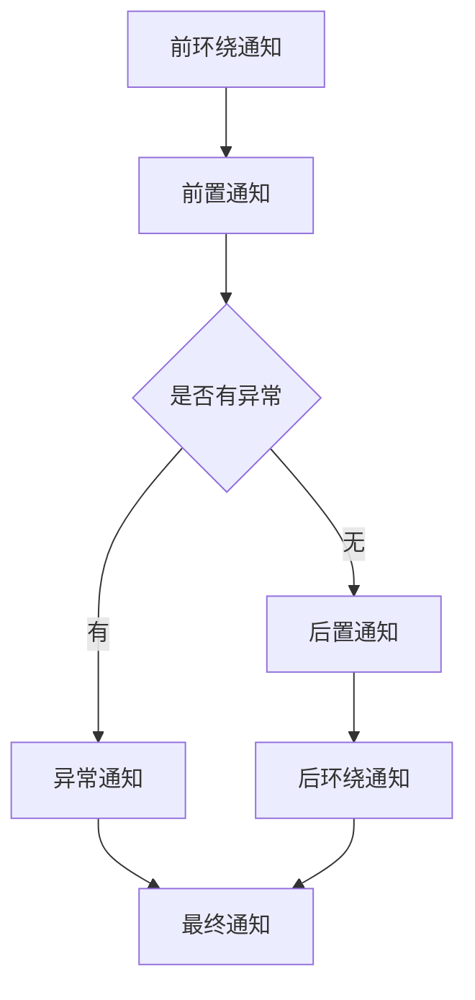

# 面向切面编程

1. 切面：在程序中和业务无关的通用代码
2. Spring的AOP是依靠动态代理实现的：JDK动态代理和CGLIB动态代理
3. 面向切面编程：将业务无关的通用代码抽取出来，形成一个独立的组件，再以横向交织的方式将其应用到业务逻辑中成为AOP


## 面向切面编程的术语

1. 连接点：在整个程序执行的过程中，**可以**切面的位置 (方法执行前后，异常抛出之后等)
2. 切点：在程序执行的流程中，**真正植入**切面的方法 (一个切点对应多个连接点)
3. 通知：也称为增强，就是具体要植入的代码
    1. 通知包括：
        1. 前置通知
        2. 后置通知
        3. 环绕通知
        4. 异常通知
        5. 最终通知
4. 切面：切点 + 通知

```java
public class UserService {
    public void do1() {}
    public void do2() {}
    public void do3() {}
    public void do4() {}
    public void do5() {}
    
    public void service() {
        try {
            // JointPoint连接点
            do1(); // Pointcut切点
            // JointPoint连接点
            do2(); // Pointcut切点
            // JointPoint连接点
            do3(); // Pointcut切点
            // JointPoint连接点
            do5(); // Pointcut切点
            // JointPoint连接点
        } catch (Exception e) {
            // JointPoint连接点
            System.out.println(e.getMessage());
        } finally {
            System.out.println("最终通知");
            // JointPoint连接点
        }
    }
}
```

## 切面表达式

1. 切点表达式用来定义通知往哪些方法上进行切入
2. `execution([控制访问修饰符] 返回值类型 [全限定类名]方法名(形参列表) [异常])`
    1. 访问权限控制符
        1. 可选项
        2. 默认包含所有权限
    2. 返回值类型
        1. 必填项
        2. `*` 表示任意类型
    3. 全限定类名
        1. 可选项
        2. 两个点 `..` 表示当前包以及子包下的所有类
        3. 省略表示所有类
    4. 方法名
        1. 必填项
        2. `*` 表示所有方法
        3. `set*` 表示所有以 `set` 开头的方法
    5. 形参列表
        1. 必填项
        2. `()` 表示没有参数
        3. `(..)` 表示任意参数类型和个数
        4. `(*)` 表示只有一个参数的方法
        5. `(*,String)` 表示第一个参数可以是任意类型，第二个参数必须是String类

## 细节

### 通知的执行顺序



### 通用切点表达式

可以通过通用切点表达式提高切点表达式的复用性

在其他类使用时需要加上全类名

```java
public class LogAspect {
    // 通用切点表达式
    @Pointcut("execution(* com.bryan016.spring6.service.OrderService.*())")
    public void generalPointcut() {}

    // 前置通知
    @Before("generalPointcut()")
    public void beforeAdvice(JoinPoint joinPoint) {
        System.out.println("前置通知");
    }
    
    // 后置通知
    @AfterReturning("generalPointcut()")
    public void afterReturnAdvice() {
        System.out.println("后置通知");
    }
}
```

### 切面顺序

当一个业务逻辑中有多个切面交织在其中，可以使用 `@Order` 注解表示切面的优先级，数值越低，优先级越高

```java
@Component
@Aspect
@Order(2)
public class LogAspect {}

@Component
@Aspect
@Order(1)
public class SecurityAspect{}
```

上述代码中，`SecurityAspect`的优先级比`LogAspect`的优先级高
